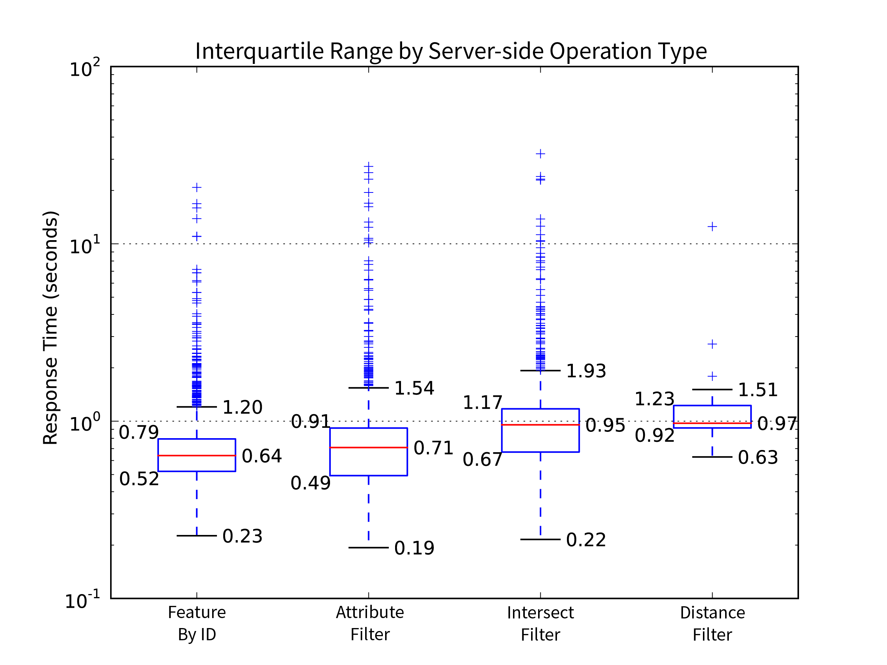
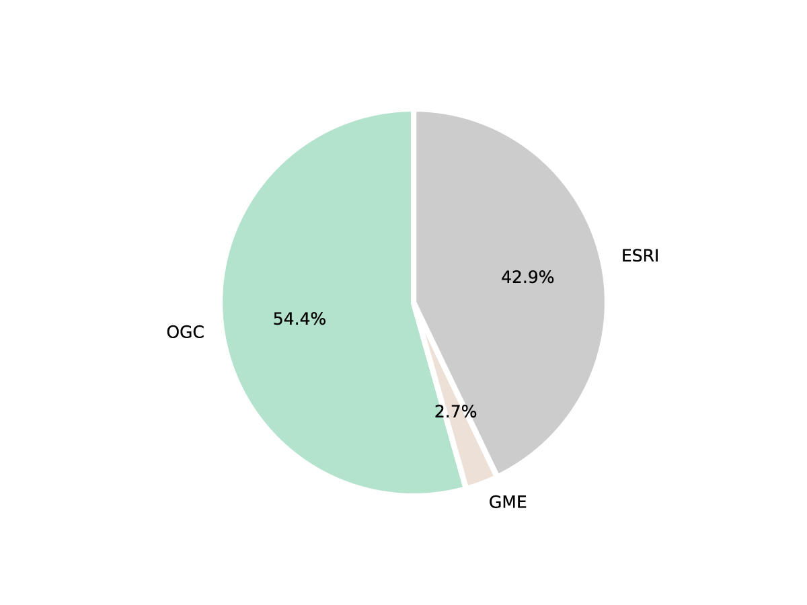
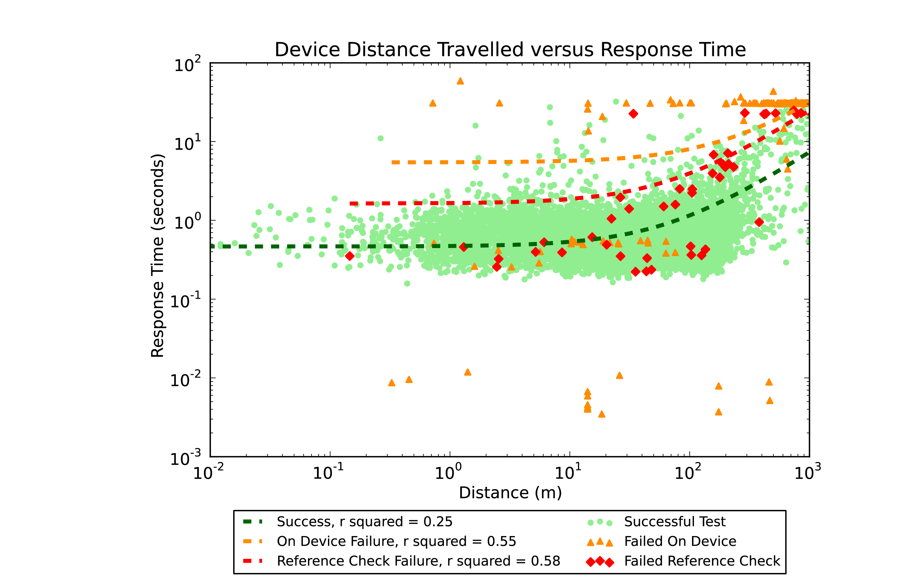

# Landgate API Test

## Abstract

Landgate is Western Australia's premier spatial data provider, the lead organisation of the West Australian Land Information System (WALIS) and its Shared Location Information Platform (SLIP). Previously dependent upon Google Map Engine spatial server infrastructure, Landgate and SLIP had to pivot rapidly to Esri spatial servers to avoid loss of service due to GME's decommissioning.

Spatial web service testing is a narrower field than the larger web service quality domain. Academic writing on the topic naturally aims to test under controlled conditions, to eliminate variables of network connectivity or device speed. This work eschews controls, preferring gathering data on the test environment at test time.

Further, academia tends to focus on response time as the main metric of service performance, an objective measure. Few papers consider whether the data returned is correct. Mobile downloads can be interrupted by lost signal.

The combination of environmental data with errors in responses grants a broader picture of Landgate's servers' suitability for mobile devices.

LandgateAPITest is a testing suite composed of an iOS application for frontline mobile device testing and a Google App Engine web application for storage, analysis and presentation of charted results.

Deploying LandgateAPITest against Landgate's GME, OGC and Esri endpoints confirms the findings of earlier studies and finds that the mobile network is the biggest factor in performance and correctness of responses.

## Acknowledgements

First and foremost, the author acknowledges the unfailing support of his wife and family. This work would not have been possible, or as thorough, without their aid.

Dr David McMeekin has been a most encouraging supervisor. His enthusiasm for the subject is infectious.

The iOS gurus at Curtin University, Tristan Reed and Jeremy Siao Him Fa, helped cut through knotty iOS and Swift problems.

## Table of Contents

<!-- TOC depthFrom:1 depthTo:6 withLinks:1 updateOnSave:1 orderedList:0 -->

- [Landgate API Test](#landgate-api-test)
    - [Abstract](#abstract)
    - [Acknowledgements](#acknowledgements)
    - [Table of Contents](#table-of-contents)
    - [List of Figures](#list-of-figures)
    - [List of Tables](#list-of-tables)
    - [Introduction](#introduction)
        - [Landgate](#landgate)
        - [Web Services](#web-services)
        - [Spatial Web Services](#spatial-web-services)
            - [Open Geospatial Consortium Web Map Service](#open-geospatial-consortium-web-map-service)
            - [Open Geospatial Consortium Web Feature Service](#open-geospatial-consortium-web-feature-service)
            - [Google Maps Engine](#google-maps-engine)
            - [Esri ArcGIS for Server and ArcGIS ReST API](#esri-arcgis-for-server-and-arcgis-rest-api)
    - [Literature Review](#literature-review)
        - [Similar Work](#similar-work)
        - [Web Service Quality and Discovery](#web-service-quality-and-discovery)
        - [Web Service Evaluation](#web-service-evaluation)
        - [Acceptance](#acceptance)
    - [Materials and Methods](#materials-and-methods)
        - [Generalised Workflow](#generalised-workflow)
        - [Data Model and Structures](#data-model-and-structures)
            - [TestCampaign](#testcampaign)
            - [TestMaster](#testmaster)
                - [TestEndpoint](#testendpoint)
                - [LocationTest](#locationtest)
                - [NetworkTest](#networktest)
                - [PingTest](#pingtest)
            - [ReferenceObject](#referenceobject)
            - [Vector](#vector)
            - [CampaignStats](#campaignstats)
        - [iOS Mobile Application](#ios-mobile-application)
            - [Mobile Application Design Principles](#mobile-application-design-principles)
            - [iOS Application Architecture](#ios-application-architecture)
            - [Swift Open Source Packages](#swift-open-source-packages)
                - [Realm Mobile Database](#realm-mobile-database)
                - [Transporter State Machine](#transporter-state-machine)
                - [Reachability](#reachability)
                - [KDCircularProgress](#kdcircularprogress)
            - [Hardware](#hardware)
        - [Google Apps Engine Web Service](#google-apps-engine-web-service)
            - [Web Service Design Principles](#web-service-design-principles)
            - [Python Application Architecture](#python-application-architecture)
            - [Python Open Source Packages](#python-open-source-packages)
                - [Matplotlib](#matplotlib)
        - [Other Applications Deployed](#other-applications-deployed)
            - [Paw](#paw)
            - [Atom](#atom)
            - [Xcode](#xcode)
    - [Results](#results)
    - [Discussion](#discussion)
    - [Recommendations](#recommendations)
    - [Future Work](#future-work)
    - [Conclusions](#conclusions)
    - [References](#references)
    - [Appendix A](#appendix-a)
        - [Web Service Requests](#web-service-requests)
    - [Appendix B](#appendix-b)

<!-- /TOC -->

## List of Figures

## List of Tables

## Introduction

Landgate is Western Australia's cadastre authority and foremost spatial data agency. They are the leading organisation in the Western Australian Land Information System (WALIS) and its open data portal; the Shared Location Information Platform (SLIP). Google Inc.'s closure of their Google Maps Engine (GME) service has forced Landgate and SLIP into a period of rapid change. Esri ArcGIS for Server infrastructure has replaced GME as Landgate's production spatial servers.

In this work, we built a testing suite consisting of a mobile application for front-line testing and a web service for analysis, named LandgateAPITest. We applied the suite to Landgate's spatial server infrastructure before and after the pivot away from GME.

The use of a mobile device as a test platform and its deployment in real world conditions is a departure from much of the academic literature on spatial web service testing. Through this work, we hope to uncover practical and actionable recommendations which can aid Landgate in improving their service to the community.

This study exists in the context of real world limitations, constraining budget, mobile devices and time. There are many, equally important, demands on the author's time. The total funds available amounted to zero Australian Dollars. Only a single mobile device could be effectively deployed in the time frame. The preset mobile data usage allowance capped the amount of testing possible within a given month before excess usage charges began eroding the previously described funding.

It is outside the scope of the LandgateAPITest suite to perform load testing (also known as a stress testing). The primary focus is on testing from a mobile device. This restricts the number of concurrent requests which could be launched at Landgate's infrastructure to a figure small enough that it would be unlikely to cause any difficulties. Conversely, such a method would have a significant negative affect on the device's battery life and the owner's mobile data plan.

Hereafter in this section, we clarify many of the organisations and services discussed throughout the paper. The Literature Review delves into the background of spatial web service testing and related works. The Materials and Methods section outlines the general workflow for the testing suite then explains the inner workings of its data model and the mobile and web applications. The Results section shows the test outcomes in charts and maps generated by the web application. The Discussion section places the results in context and leads to Recommendations and a Future Work section which details possible improvements.

### Web Services

[ ] introduce more

The development of powerful and flexible web services was the foundation that allowed the mobile web to blossom. Web services enable interaction between computer systems over a network. One system may call on another to provide data or a service without requiring a human user to mediate the interaction {Anonymous:bRhwymPh}. Mobile devices have limited processing power and storage available, so off-device storage and processing empowers on-device applications.

Service Oriented Architectures (SOA) is a standard governing software design that aims to compose a software product from loosely coupled, and hence replaceable, components {Endo:2010wf}. Designers commonly employ this pattern as a method for distributed computing {Palacios:2011eo}. A set of descriptive XML documents, such as Web Services Description Language (WSDL), enable service builders to publish to service registries and then consumers to find and bind to services suited to their needs. Communication is carried out with XML-based messages based on the Simple Object Access Protocol (SOAP), another highly capable standard.

Representational State Transfer (ReST) services are easier to develop and consume {Castillo:2011ve}. The adoption of ReSTful services has led to an explosion of data available on the web, particularly with mobile applications in mind as end consumers.

### Spatial Web Services

Spatial data is a computer representation of any information with a location dimension {Huisman:2009uj}. It digitally models the real world. Web services that deliver location data over a network or perform geospatial functions are spatial web services.

#### Open Geospatial Consortium Web Map Service

The Open Geospatial Consortium (OGC) is an international group of industry, government, academic and community representatives who aim to improve business processes through the integration of location data {Reed:2011kt}. The OGC direct their main supporting efforts towards the creation of location data and service standards and strategies.

A Web Map Service (WMS) composes an image file from server stored vector and raster layers in response to a request in a URL. The open source and standards driven approach meant that WMS was widely adopted and became a cornerstone web mapping technology. The standard is now quite old; it was last updated to version 1.3.0 in 2006 {delaBeaujardiere:2006vq}.

#### Open Geospatial Consortium Web Feature Service

A Web Feature Service (WFS) returns geographic vector data in GML (Geographic Markup Language, a derivative of XML) in response to a URL request. It is a more complex and capable service than WMS. If fully deployed, WFS allows external users full create, read, update and delete (CRUD) access to a geographic database {Vretanos:2005ut}.

The WFS standard is of a similar age to WMS. Version 1.1.0 is most commonly deployed, dating from 2005 {Vretanos:2005ut}. Version 2.0 from 2010 gained capability and complexity from GML3 and somewhat simpler use from stored queries.

#### Google Maps Engine

Google Inc.'s Google Maps Engine (GME) service enabled the creation of more sophisticated web mapping services on top of the Google Maps interface. Whereas the familiar Google Maps application only allowed one or two additional map layers to be displayed, Google Maps Engine could host many hundreds of datasets in the cloud and perform multi-layer geographic analysis {Anonymous:s3eShq99}. The full version was a true enterprise application and cloud service, with off-the-shelf or bespoke solutions created to suit a client's needs. The scalability and reliability of Google's service were a significant attractor to geospatial providers, such as Landgate.

From the 22nd of November 2014, Google redirected GME web site bound traffic to their Google Maps for Work service {Anonymous:A\_DLJUOY}, a more streamlined approach to providing enterprise mapping solutions.

In a commercial decision, Google Inc. announced the deprecation of the GME API on the 29th of January 2015 {Anonymous:2015tg}. Google shuttered the service on the 29th of January 2016.

#### Esri ArcGIS for Server and ArcGIS ReST API

ArcGIS for Server is Esri's enterprise level product for intra/Internet GIS and provisioning web services {Anonymous:BHtz-GD9}.

The ArcGIS REST API exposes ArcGIS for Server data and functions as web services. This modern API has been fully developed since 2010 {Anonymous:hoTu0aor}. ArcGIS for Server's age means it is also capable of supporting older web service standards such as SOAP.

### Landgate

Landgate is the trading name of the Western Australian Land Information Authority, the statutory authority given charge of maintaining the state's land and property information system {Anonymous:2004tv}. The organisation is the inheritor of the mandate of various incarnations of the Department of Lands and Surveys, dating back to the original Survey Office in the 19th Century.

Landgate's role incorporates managing property ownership and transfer records, as well as property valuations to government agencies {Anonymous:x1iQOCOB}. Vital to society in the connected age, Landgate is Western Australia's leading spatial data agency. Landgate has successfully commercialised spatial data creation and access. Their cumulative efforts considerably lessened their dependence on funding from the state government. The success of this strategy has led to a projected 5% increase in the number of datasets served through the 2015/16 financial year {Anonymous:2015va}.

The Western Australian Land Information System (WALIS) is a partnership between government agencies, the private sector and the community. Their aim is to improve access to location information for the betterment of the Western Australian community {LocationInformationStrategyProgramCoordinationTeam:2012te}. The Shared Location Information Platform (SLIP) is WALIS's spatial data portal, the Western Australian government's Spatial Data Infrastructure (SDI), managed by Landgate. The portal presents datasets owned and maintained by authoritative agencies, standardises data formats and simplifies access.

SLIP Future is WALIS's programme to revamp the original SLIP Enabler portal and infrastructure {Anonymous:2014ww}. The older infrastructure was deemed incapable of handling projected usage and implementing new features. WALIS built a new platform around Google's Software as a Service (SaaS) Google Maps Engine (GME). The new environment offered significant advantages in reliability, scalability and feature set {Anonymous:2014ww}.

In January 2015, Google announced the deprecation of Google Maps Engine {SLIPFuture:2015uc}. Further, they planned to shutter the service entirely by the end of January 2016 {Anonymous:2015tg}. Landgate and WALIS were left in search of a new provider for the SLIP Future programme. ESRI aggressively sought the business of GME refugee organisations {Anonymous:7YAzB1Ym} offering free software replacements and membership to business partnership programs. In July 2015, Landgate selected Esri's ArcGIS Server and Portal as the replacement for GME {Anonymous:2015uc}. Web services offering datasets in Esri's ArcGIS REST APIs will replace GME's API through a transition period through the end of 2015 and beginning of 2016.

## Literature Review

### Related Work

Web services are widely studied. However, the scope of applications for web services is broad. There are, therefore, few studies that examine the intersection of geographic web service performance, mobile device context and a single, state-level spatial data infrastructure. Following are a cross-section of papers with aims partially aligned to those of this work.

Hamas, Saad and Abed {\*Hamad:2010tr} compare the performance of SOAP and ReST APIs on mobile devices. The measured criteria are response time and transmission size which predictably favour ReST interfaces.

Their experiment design emulates a mobile device on a desktop computer; further, they restrict the simulated mobile network speed. These are useful controls in an experiment designed with a very clear aim of finding which service is faster. Real world complications such as heavy network traffic or poor signal are not addressed as a factor in the outcome. As an example, SOAP's WS-ReliableMessaging protocol may reduce overall transfer time in areas with weak signal by minimising the number of failed message attempts.

Tian et al. {\*Tian:2004cb} design a server-client system that can optionally compress responses to save the client's download limit or skip compression when the server is under heavy load to minimise timed out requests.

Working in the pre-smartphone era the team simulated an iPAQ Pocket PC, emulating the device on a Pentium III laptop. The laptop emulating the client is connected to the server via Wi-Fi, Bluetooth or a simulated mobile network. To simulate the increased latency and slower connection speed of a GPRS network, they introduced another server that throttled network speed by artificially delaying messages.

Davis, Kimo and Duarte-Figueiredo {\*Davis:2009hf} focus on OGC Web Map Service (WMS) optimisation for mobile devices. They elaborate a service that combines the multi-layer composition of WMS with the mobile device response speed of AJAX-based web maps such as Google Maps.

Their experiment implemented the proposed service and interacted with it from a custom application deployed on a Nokia N95. Given the focus on minimising data sent and received from the device, the results vindicated their hypothesis. Unfortunately, the team declined to study response time results due to "severe fluctuations" that they attributed to an overcrowded network. They conclude, by extension not experiment, that smaller volumes of transmitted data would result in faster map interaction overall.

Fowler, Hameseder and Peterson {\*Fowler:2012bn} built a custom iPhone application to test the performance of SOAP and ReST versions of a public transportation web service in Hamburg over a typical working day. They measured response time, data serialisation/deserialisation time and response size on the device itself and returned the results to their own web service. Simple and detailed messages of significantly different response size control whether response time is dependent upon message size. The results, as is common, are given as mean and standard deviation, descriptive statistics without discussion of error responses.

Fowler, Hameseder and Peterson's {\*Fowler:2012bn} methodology called for the mobile user to remain "fixed" while requesting and receiving the response, which we interpret as stationary. This is contrary behaviour for mobile device use. There are countless situations in which a mobile user would be active and moving while concurrently requesting data from a web service.

Provisioning web services from a mobile device faces similar network and device limitations as consuming a service from a mobile device. Nguyen, Jørstad and van Thanh {\*Nguyen:2008jt} explored web service performance on an emulated mobile device. While investigating the influence of varied simulated mobile network speeds, they concluded that testing on an actual device would provide ideal settings for their network simulation. Indeed, the subsequent experiment showed considerable differences between emulated and real network speed influence on web service performance. Even after modifying their simulated network speed to approximate real world network speed the difference is significant.

Hussain, Wang and Toure {\*Hussain:2014ce} test the response time and throughput of a variety of real world web services over DSL, Wi-Fi and LAN internet connections. Results are simplified to descriptive statistics, average, minimum and maximum response time.

Hussain, Wang and Toure discuss some tests with unusually long response times and speculate that it may be due to other web traffic. The specific time or other conditions of these particular tests are not elucidated. In fact, the methodology is not sufficiently detailed to provide all the parameters used in web service requests. Repeating their experiments will likely produce different results.

Yang, Cao and Evans {\*Yang:2013ff} demonstrate that WMS servers struggle with heavy loads of simultaneous requests. They recorded response times to 1, 5, 10. 30, 50 and 100 concurrent requests to six important WMS servers. They found that response times increased with the number of requests until many servers either blocked all incoming requests to handle the load or simply timed out. They make several recommendations, particularly regarding parallel requests and processing. Most helpfully to this study, a simple progress bar to indicate to a user that their request is still being processed.

Recent work by Cannata, Antonovic and Molinari {\*Cannata:2014dp} load tested the transalpine HELIDEM project's OGC web services. They measured response time as they programmatically overloaded the GeoServer system using the Locust open source Python testing library.

Tantalisingly, Cannata, Antonovic and Molinari's {\*Cannata:2014dp} paper mentions that Locust is capable of reporting testing tasks as failed even if the server returns a 200 "Success" response code with an exception in the response data. Unfortunately, they do not go on to explain this capability, nor does their testing uncover any exceptions which Locust could have revealed to them.

The emergence of ReSTful web services engendered many studies comparing performance to entrenched SOAP services. Few experimental designs take advantage of SOAP's inherent advantages, i.e. a message layer and orchestrated distributed computing, such a design would allow SOAP APIs to be compared more favourably with ReST APIs.

Castillo et al. {\*Castillo:2011ve} compare ReST and SOAP service implementations as the intermediary messaging layer for a genetic algorithm and a fitness evaluator. They also present one of the few papers to elaborate the advantages of the older SOAP API standard against a ReST API, but their experiment does not build on this. Their proof of concept methodology introduces a useful control, requests via SOAP and ReST send strings of either 100 or 1,000 characters. The proportional time difference between large and small requests controls whether the response time depends upon the amount of data sent and received, illuminating how much response time overhead is due to the API employed.

Like other researchers, Castillo et al. relate the results of their performance tests as average response time with a margin of error. They discuss accuracy, but this concerns their genetic algorithm's accuracy, not the error rate of the web service API.

Kanagasundaram et al. {\*Kanagasundaram:2012wv} expose a student database as a resource and perform Create, Read, Update Delete operations over SOAP and ReST web services. The comparison of response time between different operations leads the team to propose a hybrid SOAP and ReST web service that incorporates the security and reliability aspects of SOAP with ReST APIs' ease of development.

The experiment design places the client and server processes on separate cores of a single processor. This works well as an experimental control but comes at the expense of measuring real world performance. Furthermore, the results obtained by Kanagasundaram et al. {\*Kanagasundaram:2012wv} are averaged response times from experiments repeated until they achieved a 95% confidence level. But not all are presented in the paper, only a select subset. Presumably messages resulting in errors were excluded from the averaged results.

Expedients such as simulated mobile networks or emulated mobile devices can be more easily understood when considered in the context of testing a production server. Stress testing and automated test case generation, for example, both benefit from a quantity of tests unachievable with a few handheld devices. Services such as Load Impact {Anonymous:0z5u-mT-} emulate thousands of mobile users on a variety of devices with a range of network connectivity.

Mobile application testing is a rapidly growing field. Gao et al. {\*Gao:2014fp} identified four classes of mobile application testing approaches. Emulation-based testing, as seen above, where a device simulator runs on a desktop computer, is commonplace as emulators ship with most app development environments. Device-based testing runs the application and its services on a range of real devices to find edge case failures. Cloud testing suits large-scale tests scalable to requirements. Crowd-based testing employs volunteers or contractors to test apps and can reach reasonable scales; they note that tests may not be thorough.

Yan et al. {\*Yan:2012uf} built a cloud testing suite, an approach they called Web Service - Testing-as-a-Service (WS-TaaS). Their experiment showed that cloud tested web services were capable of responding to significantly more requests than one tested on a single desktop computer. Most likely due to the limited bandwidth and processing power of the single testing node.

### Web Service Quality and Discovery

[ ] Citation to support topic sentence

Automating web service discovery is a much more active field of research with the aim of supporting semantic web development. An application should be able to bind the web service without supervision from the end user. How then, though, should the application choose which web service to employ from the multitude available, also without requiring user intervention. The investigators below are proponents of systematically and automatically applied quality metrics as a basis for deciding which web services should be bound.

Palacios, Garcia-Banjul and Tuya {\*Palacios:2011eo} surveyed Service Oriented Architecture literature to find articles focussed on dynamic binding. 57% of the 33 articles detected faults in web services and thereby excluded non-responsive services.

Orion, Marco and French {\*Oriol:2014kq} reviewed the state of the art in quality of service models for web services, surveying 65 papers written between 2001 and 2012. They showed that most researchers were assessing web services quality regarding availability (essentially the probability a request will receive a response) with 94% of surveyed papers defining the metric. Response time was second place at 83% coverage and accuracy third with 62%.

Wu et al. {\*Wu:2011kk} propose web service registries evaluate the quality of services they expose. Service downtime, mismatches between catalogued metadata and current capability or inconsistencies when registered in multiple catalogues can lead to the selection of a suboptimal web mapping service. The catalogue service periodically interrogates an OGC WMS testing all operations listed in its GetCapabilities document. Successful tests decrease the frequency of future tests while a lack of response increases the frequency.

Wu et al. model quality factors using a hierarchical tree, proposed by Hanwu Zhang, one of the authors in their Ph.D. dissertation from 2008 (reference not found in English translation). This is a helpful concept for automated quality analysis as branches in the hierarchy can be weighted differently, emphasising categories of metrics (the "leaves") over others. Unfortunately, Wu et al.'s automated analysis stops after comparing the most recent response time to a weighted average of previously recorded response times. They go on to assess map data quality through a survey method. A GUI program presents returned data to an expert user for assessment and scoring out of five on a series of quality metrics.

Miao, Shi and Cao {\*Miao:2011dh} build upon Wu et al.'s method of adaptable testing frequency by halving test intervals when the response time is greater than the average of earlier tests. They go further to parameterise the proportion of failed requests. Their process is explained well in a flow chart, omitted from many similar papers.

Miao, Shi and Cao developed a C based program to crawl 100 WMS servers to measure their performance and stability as per their procedure. The conference paper referenced here omitted a table listing the servers assessed. As with Wu et al., the team leaves data quality assessment to a survey of expert users.

### Web Service Evaluation

The OASIS Web Services Quality Factors {Kim:2012wm} defines six quality factors with 28 sub-categories.

    1.    Business Value Quality - the value arising from using a web service as compared to the cost.
    2.    Service Level Measurement Quality - the service responsiveness from a client's point of view, including time and success criteria.
    3.    Interoperability Quality - the degree to which a service conforms to appropriate standards.
    4.    Business Processing Quality - the service's reliability for business use considering transmission integrity and integration with other processes.
    5.    Manageability Quality - management processes to ensure web service quality.
    6.    Security Quality - the service's ability to prevent intrusion, interception or destruction of the service itself or its messages.

Taken all together these represent all factors that affect a client's decision to consume a web service.

The scope of this study is limited to those aspects of Landgate's service that affect their suitability for use on mobile devices. The business process and value, management, interoperability and security factors cannot be tested with a mobile device. These are more suited to desktop studies and surveys of existing clients. Only Service Level Measurement Quality is within the purview of this study.

The sub-categories include;

    1.    Response Time - the time interval between the transmission of a request and the receipt of a response. The total time is composed of the time taken for the client to compose the request and decompose the response plus the network transmission time to and from the server plus the time taken for the server to process the request and formulate a response.
    2.    Maximum Throughput - the maximum number of requests a service can reliably respond to in a unit of time.
    3.    Availability - the proportion of time the server is operational, the complement of service downtime per measured time.
    4.    Accessibility - the probability of the web service can be reached when the system is operational, quantified as the number of received acknowledgement messages divided by the total number of requests.
    5.    Successability - the probability of receiving a successful response to a web service request, the number of responses divided by the number of requests.

We propose to track these factors through a series of frequent but irregularly timed tests from a mobile device deployed in situations common to the mobile network milieu.

### Acceptance

Park and Ohm {\*Park:2014jp} used survey data to construct a technology acceptance model to investigate users' acceptance of mobile mapping applications. They found that acceptance and hence intention to use a mobile mapping service depended to a large degree upon two factors; perceived locational accuracy and processing speed. Park and Ohm defined perceived locational accuracy as how well users envision their location in the map, essentially the degree to which mapped features correspond with a user's mental model of the world and where they are in it.

## Materials and Methods

### Generalised Workflow

The mobile application's user chooses to initiate a test against the Landgate servers. There are several types of test; each offers a different combination of subtests on a variety of Landgate endpoints. All subtests are enqueued and assuming that a few preconditions are met the testing begins.

Testing proceeds in a cycle. First, a LocationTest determines the device's latitude and longitude. A NetworkTest queries the device's connection to the mobile network. A PingTest checks the ping time to a well-known endpoint other than Landgate. Then the device sends one of the pre-ordered requests to Landgate's servers and captures the response data in an EndpointTest. The cycle repeats until there are no more EndpointTests in the queue.

The client/server interaction has several failure points. It is important for this work to record failed requests as these affect a service's suitability for mobile network traffic. The device may be unable to reach the endpoint at all due to a total lack of connectivity (recorded as response code "0") or if a TestEndpoint is interrupted before its conclusion. The server may reject the request; these are the 400 series response codes (for example the oft seen 404 code for a missing resource or 403 for failed authorisation). A server-side fault that prevents a proper response is assigned a 500 series response code (such as the catch all 500 Internal Server Error code). Should the device fail to reach the server, or the server respond with a 400 or 500 code, the iOS LandgateAPITest app records the TestEndpoint as a failure. These are referred to as "On Device Failures".

Note that 300 series response codes, the resource moved or redirect codes, are not considered failures. The test continues to the redirected resource where it will eventually earn a 200 success code or one of the failure codes.

Immediately upon the test commencing the device records the current date and time as a Unix time value, the number of seconds since 00:00 on the first of January 1970. Similarly, when the test concludes (successfully or otherwise) the device records the current date and time again. The total response time is the difference between these two time values.

After all tests in the queue are complete the device stores all tests, their details and response data to a local database. The mobile app can query this database to display results to the user.

The user may choose to upload the results to the LandgateAPITest web app at a later time, ideally when the device is connected to Wi-Fi. It is not desirous to immediately upload the result as it could double the data usage on the user's mobile data plan. Should an upload fail, the user may retry as many times as they wish.

LandgateAPITest's web application conducts the analysis on all results for each campaign of testing. When each test is successfully stored in the web app's database, it adds a task to the app's task queue. When the app has spare processing capacity, the queued task fires a request to the app to analyse the result.

In the analysis, the web app attempts to create a new Vector object to contain the results of the analysis. It requires the LocationTest, NetworkTest and PingTest results from directly before and the same from directly after each EndpointTest. Given the sequence of location, network, ping and endpoint tests each Vector shares its following three results with the next EndpointTest.

A gateway decision requires all six tests be present. Should one be missing the analysis is aborted and the result disregarded.

Otherwise, the web app proceeds to check the EndpointTest's response data against a set of reference data. These are exemplar responses to each request which we assume to be the "true" data.

If the response received by the iOS app is identical to the reference response, then we consider the entire test successful. The iOS application may assume a test is successful given it receives a 200 response code from the Landgate server. Often though OGC servers will respond with a 200 code but send exception text in place of the response data. Tests that fail at this stage are referred to as "Reference Check Failures" and have an appropriate flag set on the record on the web application database.

During execution of the /Analyse function, the web app records the percentage of reference check tests successful for each test type. Should a test type return less than 5% successful reference checks we assume that there is a process error or an incorrect reference object and disregard the test type entirely. Such tests are flagged False for their "ReferenceCheckValid" property to allow them to be filtered out.

The resultant Vector objects are the basis for all analysis and graphical representation. The web application produces pie charts of the various test categories and graphs of response time or distance travelled by category. Each graph is available from the /graph endpoint and responds with the latest information in the database.

### Data Model and Structures

The application code draws a distinction between a Test object and a Result object. The Tests are templates and the action of performing a test. Where Results are concrete records of enacted tests, stored in a database and the subject of analysis.

So a LocationTest would be the template and the act of determining the device's location. A LocationResult is the latitude and longitude output stored on the device and uploaded to the web application.

#### TestCampaign

A unique and human-readable string identifier which groups many TestMasters into a single campaign, potentially from multiple devices. This class combines tests into a unit of work for an individual client.

The TestCampaign class in the web application has no properties other than its name. It serves as the ancestor key for all TestMaster, Vector and CampaignStats objects, simplifying their retrieval from the datastore. In the case of this work the test database used "test_campaign" and the production database used "production_campaign" as the test campaign names.

#### TestMaster

A TestMaster encapsulates all tests undertaken in a single user-initiated test. The LocationTests, NetworkTests, PingTests and EndpointTests performed from a given user test have the same TestMaster as their parent object. This allows all the various subtests to be queried with their fellows in the /Analyse function.

TestMasters also group subtests according to the user's perception of the manner in which the tests were done. Thus, allowing the user to review a TestMaster and its children as a single unit of test work in the iOS app interface.

All TestMasters and their children inherit from the ResultObject superclass in both the web and iOS applications. In this manner, they inherit the same properties of datetime, testID, parentTestID and so forth. This is for the sake of convenience and avoiding repeated code.

TestMasters have properties relating to the test device itself which cannot change through the cycle of subtests. The record includes the device type, the version of its operating system and a unique identifier for the device. The device ID is Apple Inc.'s "ID for vendor" a key unique to both the device and the application vendor. This key cannot be traced to a particular device without the application's signed certificate.

The database record corresponding to a TestMaster is a TestMasterResult object.

##### TestEndpoint

The primary focus of the study, TestEndpoints request a set response from the Landgate server. The TestEndpoint records the details of the template (server type, HTTP method, the URL and so forth), the test's outcome (successful or failed on the device), the start and finish time and date, and the data received in the endpoint's response.

TestEndpoints are stored in the iOS application database as EndpointResult objects. Each TestMaster will enact dozens of TestEndpoints. Consequentially, each TestMasterResult will be the parent to dozens of EndpointResults.

##### LocationTest

Acquiring the mobile device's position throughout testing is key to LandgateAPITest's methodology. From this information, we can derive information on the environment in which a given test was undertaken, such as device travel distance and speed.

A LocationTest acquires a latitude and longitude value in the WGS84 coordinate reference system common to GPS devices.

The LandgateAPITest iOS app requests a 10-metre accuracy for location fixes. This accuracy is not guaranteed, should the device be unable to locate with the desired accuracy it will report what it can after timing out. As with all GPS devices, the environment affects location accuracy, particularly when testing indoors. Looser GPS accuracy saves the device's battery power which otherwise would be wasted in trying to acquire a more accurate location fix.

The web application and iOS application databases store each LocationTest's outcome as a LocationResult.

##### NetworkTest

The mobile network connection varies depending on the cell tower, its capabilities and obstacles in the intervening space.

A NetworkTest queries the iOS device for the properties of its network connection. Each NetworkTest records the mobile network provider (called carrier in mobile device parlance) and the class of the mobile network (for example, EDGE, HSDPA, LTE).

LandgateAPITest tests specifically for a Wi-Fi connection before testing for a mobile network connection.

NetworkTest's have a property to hold a unique identifier for a cell tower. In its current form, LandgateAPITest does not record anything in this property. The iOS device reports details of its mobile network connection through Apple's Core Telephony framework. Intended for the use of mobile communication providers much of Core Telephony's functionality is private. Apps utilising such functions submitted to Apple Inc.'s App Store for review will be summarily rejected. The code LandgateAPITest uses should not be condemned under the current regime. Recording the cell tower id would be cause for rejection, however, so it is excluded.

The result object for a NetworkTest is a NetworkResult.

##### PingTest

As LandgateAPITest cannot directly test network connection speed, we take a proxy in its place. A PingTest sends a HEAD request to www.google.com.au and measures the time until it receives a response. HEAD requests do not demand any data in the response body, so any intervening time is a factor of the mobile connection and processing time on the Google web server. These two factors are unfortunately inseparable given the app's limitations.

The result object stored in the database for a PingTest is a PingResult.

#### ReferenceObject

ReferenceObjects hold the correct response data from the Landgate servers for each request. Server, returnType and other test template properties identify ReferenceObjects from one another and allow comparison to a TestEndpointResult. The reference property holds the response data in text, either XML, JSON or images converted to base64 text.

These exemplar responses were requested and stored on the 5th of April, 2016. This postdates GME's replacement. References for GME requests were stored in April 2016 from the first test responses in December 2015. Dynamic parts of responses were excluded from the final ReferenceObject, for example, any date or time value that changes between requests.

The administrator uploads text files containing ReferenceObject references to the web application's code repository. A request to the /StoreReferences endpoint enqueues a task to add new and replace old ReferenceObjects with the text file contents.

#### Vector

The web application's /Analyse function parses each TestEndpoint object and attempts to generate a new Vector object. Vectors encapsulate the LocationTest, NetworkTest and PingTest immediately preceding the TestEndpoint along with those immediately following it, retaining pointers to these objects. The function determines the change in Location, Network conditions and Ping response time and takes them as a proxy for the mobile device's changing connectivity environment through the EndpointTest.

The logic to retrieve the six related subtests from the datastore is as follows;

1. Query only those records specific to the subtest type (LocationTests, NetworkTests or PingTests)
2. Retrieve only results with the same TestMaster key as the TestEndpoint
3. Filter results to only those with a datetime property less than the TestEndpoint's datetime for the three preceding subtests (or greater than for the three following tests)
4. Sort the results by their datetime, descending for preceding subtests and ascending for following subtests
5. Return only the first result, that being the closest in time to the TestEndpoint

If any one of the six subtests is absent, the Vector object cannot be reliably created and the process is aborted. The TestEndpoint is marked "IMPOSSIBLE" to prevent any further automated attempts at analysis. Such objects are not considered any further in this study. Situations like this may arise where the device cancelled a test partway through, precluding the three following tests.

The Haversine distance formula gives a great circle distance travelled between two LocationTests (essentially a straight line at these scales). Dividing this result by the time difference gives an average speed in metres per second. The time between two LocationTests is not the same as the TestEndpoint's total elapsed time. The interval is greater as it allows for NetworkTests, PingTests and the duration of the LocationTests themselves.

The generation of the mobile network is here taken as a proxy for connection speed. For example, LTE is a fourth-generation network and assigned 4.0 for a networkClass property, where HSDPA would be assigned 3.5, CDMA 2.5 and so on. We assume that Wi-Fi is generation 5.0 due to its higher potential connection speed. Subtracting the following networkClass from the preceding one gives a networkChange value. Positive values reflect improving network generation and negative values degrading.

The change in response time for a HEAD request to google.com.au before and after an EndpointTest is another proxy for change in network connection speed. Subtracting the following test's response time from the preceding test's response time gives a positive pingChange value for improving network speed and a negative one for degrading speed.

The /Analyse function also performs the reference check. It assigns the Vector's referenceCheckSuccess property a True value if the TestEndpoint's response data contains the ReferenceObject's reference text or False otherwise.

Vector objects are the basis for all further analysis in this study. All graphs in this work show the Vector rather than the original TestEndpoint or its subtests.

#### CampaignStats

The CampaignStats class stores counts of TestEndpoints and other subtests, enabling calculation of descriptive statistics for a particular TestCampaign. CampaignStats updates when the iOS application uploads a new TestMaster to the database, adding new counts onto existing values. Also, when the /Analyse function creates a new Vector object it updates the CampaignStats properties for reference check success.

The overwhelming majority of CampaignStats properties concern the percentage of successful reference object checks. 0% reference check success rates will exclude the entire test type from further consideration. See the Results section.

### iOS Mobile Application

#### Mobile Application Design Principles

The LandgateAPITest iOS application should be quick to build and simple to maintain. The app's design eschews user interface flair in favour of basic views, such as the ubiquitous UITableView. This has the beneficial side-effect of making the app familiar and easy to use for a broader range of the community.

Where possible, open source libraries should replace handwritten code. There being no point to reinventing functionality already well developed and freely available. A common pattern in modern app development, community supported libraries fill narrowly focussed functions. These are easily incorporated into an iOS project through dependency management applications and community code repositories such as GitHub.

LandgateAPITest is not a privacy focussed app. The application collects data that many would consider intrusive, such as location or mobile network connection details. Without this information, the application would not fulfil its objectives. The app's help text encourages users who find such invasiveness unacceptable to uninstall the application.

The application is also a heavy user of the device's battery and mobile network downloads. These are similarly unavoidable, being core to the application's function. The help text highlights that users may upload a test while on a Wi-Fi network to avoid data charges for uploading a TestEndpoint's response data.

Given these two points, users could be justly concerned that the application would be a noticeable drain on their battery and data plan. We address this issue by only testing when the application is in the device's foreground, that is on the screen while the device is awake. Should the application be sent to the background, it immediately enters an abort state, cancelling active tests and storing what results it has to the database. This can be triggered by the user selecting a different app, clicking the Home button, or by an interrupting phone call.

#### iOS Application Architecture

Apple Inc. advocates the Model-View-Controller (MVC) design pattern in object-oriented code. A controller class intermediates all interaction between the data model layer and the views on the device screen. LandgateAPITest follows this pattern by implementing viewcontroller classes for each screen presented to the user.

The majority of the application's logic does not reside in viewcontrollers however. It is a common problem in MVC pattern design that the controller classes amass logic to the point of becoming unwieldy and difficult to maintain. LandgateAPITest's viewcontrollers call upon the SingletonTestManager and SingletonUploader classes when the user initiates a test or an upload to the LandgateAPITest web app respectively. These act as an interface for the model layer, abstracting model logic from the point of view of the viewcontrollers.

Firing requests at Landgate's endpoints concurrently, rather than synchronously, would give unreliable response time results. An analysis would not be able to determine what proportion of response time was a factor of the device resolving multiple threads of computation. To avoid this complication LandgateAPITest's iOS app uses a state machine architecture.

The state machine completes functions sequentially. The completion of each test fires an event function causing the application to change state and after that perform different functions.

When the user initiates a test the SingletonTestManager class switches to its prepareForTest state where it checks preconditions and creates a TestMaster object. From there the SingletonTestManager enters a loop; testing location, network, ping time to google.com.au and then testing a Landgate endpoint (a TestEndpoint) and back to location. The loop continues until the TestMaster's queue of TestEndpoints is exhausted, after which the device writes the TestMaster and all its subtests to its database. Each state performs distinct actions and does not interfere with tests preceding or following as none may start until the earlier test has successfully finished.

At any time the state machine may abort the loop if the preconditions are not met, the app leaves the foreground, or the battery is exhausted. It immediately skips to the post-test state and attempts to save the test results gathered to the device database. Any test (endpoint, location, network or ping) cancelled part-way through is aborted and marked as "Failed On Device."

Uploading in the background of the application uses a similar pattern. The SingletonUploader class changes state from "Ready" to "Uploading" and thence to "Success" or "Failure" depending on the response code from the web app. It settles back to the "Ready" state once its upload queue is emptied.

#### Swift Open Source Packages

##### Realm Mobile Database

The Realm open source mobile database {realmrealmcocoa:2016vs} is a much simpler on-device storage solution than the proprietary Apple Inc solution. LandgateAPITest stores all test results in a Realm database file.

##### Transporter State Machine

Denis Telezhkin's Transporter library {DenHeadlessTranspor:2016ta} offers a straightforward state machine implemented in Swift, available under the MIT licence. LandgateAPITest relies upon Transporter state machines for the SingletonTestManager and SingletonTestUploader classes.

##### Reachability

Ashley Mill's Reachability library queries the device to determine whether and how it is connected to a network {ashleymillsReachabi:2015to}. LandgateAPITest depends on Reachability's response in two areas. Firstly, having a network connection is a prerequisite to starting a test, either through Wi-Fi or 2G, 3G or 4G mobile network. Secondly, the iOS standard telephony libraries report a mobile network connection regardless of whether there may be an overriding Wi-Fi network connection. LandgateAPITest checks Reachability beforehand for a Wi-Fi connection.

##### KDCircularProgress

Kaan Dedeoglu's KDCircularProgress library initiates a progress indicator that fulfils a circular ring as the task approaches completion {kaandedeogluKDCircu:2015vt}. LandgateAPITest uses KDCircularProgress to show the percent completion of a test, updating the indicator each time a sub-test calls its completion delegate method. The library was chosen as it aligned with the design aesthetic of recent iOS releases.

### Google Apps Engine Web Service

#### Web Service Design Principles

The ideal for any web service is to present the latest available data to requesters. LandgateAPITest presents statistics, maps and analysis on objects in the datastore at request time. End users need not await final reports but can check on the status of a testing campaign whenever they wish.

The iOS testing app can produce a large set of testing data in a short timeframe. Cloud computing power is capable of scaling to accommodate excess load, but at a cost. The web application acts to smooth out high load by deferring computationally intensive tasks to avoid peak load and minimise cost.

The web application should analyse TestEndpoint results and not just represent them. Generating actionable information from pure data has much more value to the end user. Similar applications produce appealing graphs with little scientific merit. LandgateAPITest's charts, while less visually gripping, offer in-depth analysis and proper scientific methodology.

#### Python Application Architecture

Google App Engine (GAE) Python applications derive their basic functionality from the webapp2 open source library {Welcometowebapp:2011vk}. Developers define web app endpoints and map them to Python classes, so landgateapitest.appspot.com/database maps to the Database class in Python code. Then the HTTP method maps to functions within that class. A POST request to the /database endpoint fires the Database class's post() function adding the request body to the database. A GET request calls the get() function and downloads a TestMaster record to the requester.

Python functions may call for a task to be enqueued. The GAE system will fire the specified request at a later time, ideally when processor load is minimal. A successful POST request to the /database endpoint queues an /Analyse endpoint GET request as one of its last tasks. Similar tasks which are anticipated to consume more than trivial resources are deferred as queued tasks in LandgateAPITest, such as importing reference text files to the datastore or updating the model schema.

Google App Engine applications may use any of Google Inc.'s several cloud data storage solutions. LandgateAPITest uses Google Cloud Datastore, a NoSQL database quite distinct from relational databases in that it does not store all records as atomic rows in tables, rather as schema-less objects in distributed documents.

#### Python Open Source Packages

##### Matplotlib

Well known in academia, Matplotlib is an open source Python library capable of producing detailed graphs from complex datasets {matplotlibmatplotli:2016vd}. LandgateAPITest's web app leveraged Matplotlib to build graphs of up to the minute Vector object data queried from Google's Cloud Store. Programmatically compiling the figures in this report allows them to be recreated on demand with the latest information from testers.

Matplotlib's analytical power is enhanced when paired with Numpy {NumPyNumpy:2016vy}. A mathematically focussed library, most useful in LandgateAPITest for its arrays, which are much more analytically oriented than generic Python list collections.

##### Leaflet

The LandgateAPITest web application offers a heatmap of test locations. More precisely, the map shows each Vector object's LocationTest prior to the EndpointTest. Leaflet {Agafonkin:2016wz} is a lightweight JavaScript mapping library, it is ideal for a simple application such as this.

Visualising 16,000 test locations as generic markers would result in a confusing map. The Leaflet.heat {Agafonkin:2015ww} library generalises multiple points into a single heat map layer. Closely clustered tests are represented by warmer colours, dispersed ones by cooler colours. OpenStreetMap tiles comprise the base map, available under a CC BY-SA open licence and built by the community of OpenStreetMap contributors.

### Other Applications Deployed

Besides code incorporated directly into the product applications, several other applications were instrumental to app development.

#### Paw

Keeping track of 46 ReST requests, each with minor variations from its neighbours, required more than a handwritten list. Paw (version 2.3.3) {Anonymous:tn} is a Mac application designed for testing ReST requests. It simplifies the process of composing the request and its query components. Its most helpful feature is its Swift NSURLSession code output, suitable for directly pasting into an iOS application repository. The code in LandgateAPITest's EndpointTester class where it fires a request to the Landgate server is derived from Paw's example code.

#### Atom

Atom (version 1.7.2) {atomio:vz} is Github Inc's open source text editor used primarily for LandgateAPITest's Python web app development. The Github community has built a plethora of extensions expanding the application's capabilities far beyond the average plain text editor. This entire report was draughted in MarkDown styled plain text in Atom.

#### Xcode

Apple Inc's Xcode Integrated Development Environment (IDE) {Anonymous:3QN3N1hm} is the orthodox application for developing apps for Apple machines. LandgateAPITest's iOS app was entirely built in Xcode version 7.3.

## Results

### Test Regime

The "production_campaign" featured two main pushes of testing. The first in December 2015 through to January 2016 tested Google Maps Engine endpoints before their shutdown. The campaign's main thrust took place in March 2016 where the majority of tests queried the old OGC endpoints and the new Esri endpoints.

The user initiated 284 TestMasters resulting in 16,144 TestEndpoints with similar numbers of LocationTests, NetworkTests and PingTests.

| Test                | Count     |
|------------------------    |------:    |
| Count Test Masters         |   284     |
| Count Test Endpoints       | 16144     |
| Count Location Results     | 16391     |
| Count Network Results      | 16391     |
| Count Ping Results         | 16345     |

There were three theatres of action in the campaign. Each test is mapped in a Leaflet web map using the location of its Vector's PreTestLocation (the LocationTest completed before the TestEndpoint began). Visualising 16,000 points would result in an ineffective map, so here closely clustered points are generalised into a heat map. A beneficial side effect of generalisation is to obfuscate precise locations.

The majority of tests took place in Sydney, NSW and its environs. In particular the regular commute over the harbour to the Central Business District, and the roads and freeways to neighbouring cities.

Several discrete bursts of tests took place in Bathurst, NSW and the highway back and forth to Sydney, NSW.

Townsville, QLD was the theatre with the least number of tests, but some interesting mobile situations involving ferry crossings and steep terrain on Magnetic Island.

### Test Device Hardware

All tests were performed on an Apple iPhone 6S, model A1688 (a.k.a. iPhone8,1), with 64GB of storage. The standard device comes with a range of mobile radios across many bands; LTE, HSDPA, CDMA, GSM, EDGE, Wi-Fi radios a/b/g/n/ac and GPS and GLONASS receivers {Anonymous:uf}.

|    |    |
|-------------------------------------    |--------------    |
| Campaign Name    | production_campaign         |
| All Device Types | iPhone8,1                   |
| All iOS Versions | 9.1, 9.2, 9.2.1, 9.3, 9.3.1 |

The operating system changed through the campaign as Apple Inc. updated their software. The first tests launched LandgateAPITest on iOS 9.1, later tests on 9.2, 9.2.1 and later still on 9.3 and 9.3.1.

### TestEndpoint Successes and Failures

Of the 16,144 TestEndpoints 15,670 were successful on device (97.06%). These were able to complete the test and received a 200 response code from the Landgate server. The 2.94% of on device failures either could not reach the server (response code 0) or received a server error response (code 500 and above).

LandgateAPITest's /Analyse function compared each TestEndpoint's response data to the stored reference data and determined that 13,220 of them match, setting the resultant Vector's referenceCheckSuccess flag to True.

Closer examination of referenceCheckSuccess by test type showed 9 test types that consistently failed their reference checks (less than 5% passed). All such Vectors had their ReferenceCheckValid flag set to False to exclude them en masse from further analysis on the assumption that there was a systematic issue with their reference data.

Notably, the GetCapabilities tests rarely passed reference checks. Likely causes include changes to services offered during the test campaign or possibly timestamps buried in the XML response and reference conflicting.

| Test Name                                           | Percent Reference Check Successful |
|-----------------------------------------------------|--------------------:|
| ESRI - BusStops - AttributeFilter - GET - JSON      | 98.79%             |
| ESRI - BusStops - AttributeFilter - POST - JSON     | 98.20%             |
| ESRI - BusStops - Big - GET - JSON                  | 101.06%            |
| ESRI - BusStops - Big - POST - JSON                 | 101.03%            |
| ESRI - BusStops - FeatureByID - GET - JSON          | 99.00%             |
| ESRI - BusStops - FeatureByID - POST - JSON         | 98.76%             |
| ESRI - BusStops - GetCapabilities - GET - JSON      | 97.64%             |
| ESRI - BusStops - GetCapabilities - POST - JSON     | 98.99%             |
| ESRI - BusStops - IntersectFilter - GET - JSON      | 97.31%             |
| ESRI - BusStops - IntersectFilter - POST - JSON     | 98.21%             |
| ESRI - BusStops - Small - GET - JSON                | 96.98%             |
| ESRI - BusStops - Small - POST - JSON               | 97.89%             |
| ESRI - Topo - Big - POST - Image                    | 99.45%             |
| ESRI - Topo - Small - GET - Image                   | 99.32%             |
| ESRI - Topo - Small - POST - Image                  | 100%               |
| GME - AerialPhoto - Big - GET - Image               | 96.97%             |
| GME - AerialPhoto - GetTileKVP - GET - Image        | 95.65%             |
| GME - AerialPhoto - GetTileKVP2 - GET - Image       | 93.75%             |
| GME - AerialPhoto - GetTileKVP3 - GET - Image       | 90.63%             |
| GME - AerialPhoto - GetTileKVP4 - GET - Image       | 90.91%             |
| GME - AerialPhoto - Small - GET - Image             | 86.36%             |
| GME - AerialPhoto - WMSGetCapabilities - GET - XML  | 0%                 |
| GME - AerialPhoto - WMTSGetCapabilities - GET - XML | 0%                 |
| GME - BusStops - AttributeFilter - GET - JSON       | 83.87%             |
| GME - BusStops - Big - GET - JSON                   | 0%                 |
| GME - BusStops - DistanceFilter - GET - JSON        | 93.75%             |
| GME - BusStops - FeatureByID - GET - JSON           | 96.55%             |
| GME - BusStops - IntersectFilter - GET - JSON       | 90.63%             |
| GME - BusStops - Small - GET - JSON                 | 0%                 |
| OGC - AerialPhoto - GetTileKVP - GET - Image        | 98.85%             |
| OGC - AerialPhoto - GetTileRestful - GET - Image    | 98.36%             |
| OGC - BusStops - AttributeFilter - GET - JSON       | 0.83%              |
| OGC - BusStops - AttributeFilter - GET - XML        | 99.72%             |
| OGC - BusStops - AttributeFilter - POST - JSON      | 98.63%             |
| OGC - BusStops - AttributeFilter - POST - XML       | 99.45%             |
| OGC - BusStops - Big - GET - JSON                   | 100%               |
| OGC - BusStops - Big - GET - XML                    | 100%               |
| OGC - BusStops - Big - POST - JSON                  | 100%               |
| OGC - BusStops - Big - POST - XML                   | 100%               |
| OGC - BusStops - FeatureByID - GET - JSON           | 99.30%             |
| OGC - BusStops - FeatureByID - GET - XML            | 98.85%             |
| OGC - BusStops - FeatureByID - POST - JSON          | 100%               |
| OGC - BusStops - FeatureByID - POST - XML           | 99.54%             |
| OGC - BusStops - GetCapabilities - GET - XML        | 2.88%              |
| OGC - BusStops - GetCapabilities - POST - XML       | 1.26%              |
| OGC - BusStops - IntersectFilter - GET - JSON       | 99.73%             |
| OGC - BusStops - IntersectFilter - GET - XML        | 99.46%             |
| OGC - BusStops - IntersectFilter - POST - JSON      | 99.46%             |
| OGC - BusStops - IntersectFilter - POST - XML       | 100%               |
| OGC - BusStops - Small - GET - JSON                 | 98.81%             |
| OGC - BusStops - Small - GET - XML                  | 100%               |
| OGC - BusStops - Small - POST - JSON                | 99.76%             |
| OGC - BusStops - Small - POST - XML                 | 98.83%             |
| OGC - Topo - Big - GET - Image                      | 3.63%              |
| OGC - Topo - Small - GET - Image                    | 3.48%              |

See Appendices A and B for a list of URLs for each request.

Of the remaining tests only 79 (0.6%) failed a reference check. And 2.9% of the referenceCheckValid tests failed on the device itself.

### Test Results by Response Time

The LandgateAPITest web application produces charts of current data on request to the /graph endpoint. All charts in this text are saved versions of these as they stood on the 7th of May, 2016. Links are provided in the text to the endpoint for each chart displayed so that the reader may receive the latest information.

The various requests are subcategorised by their test name, a general description denoting near identical requests across the three server types. A FeatureByID request returns the same data from all three servers, though it may not be in the same format (GML, Esri JSON, GeoJSON for example). [This pie chart](https://landgateapitest.appspot.com/graphs?campaignName=production_campaign&graphName=graph3) was modified to exclude some of the smallest percentage test types to aid reading clarity.

Aligned with Fowler, Hameseder and Peterson's {\*Fowler:2012bn} experimental control showing that response data size affects response time, LandgateAPITest requests "Small" and "Big" responses. Small requests are either for a few features in GML or JSON or an image only a few tens of pixels in dimension. Big requests ask for 100 vector features or images 500 pixels in dimension.

The distribution of their response times are shown in a box and whiskers chart, available at this [link](https://landgateapitest.appspot.com/graphs?campaignName=production_campaign&graphName=graph25). Box and whiskers charts show the interquartile range of a distribution. The dataset is divided into four equal parts around the median value, shown as a red line. The first quartile (Q1) to the third quartile (Q3) are contained within the blue box and contain 50% of the points in the dataset. The "whiskers" above and below the box show the range of the data and in a normal distribution would contain over 99% of the data points. Skewed distributions end up excluding the outliers from the interquartile range, shown here as blue crosses.

The "Big" requests have a similar Q1 to Q3 (interquartile range) to "Small" ones. The lowest values in the whiskers are significantly slower to arrive. Both have a significant number of outliers above the maximum response time whisker.

Spatial servers can filter results either by a function of the attributes of each feature, returning features from any location meeting certain criteria of their properties. Features may instead be filtered by a spatial function, returning features from a specific location of any attribute value. The response time frequency distributions for four test types which call upon the server to filter results are shown in the [box and whiskers chart](https://landgateapitest.appspot.com/graphs?campaignName=production_campaign&graphName=graph26). Feature by ID calls for a single feature with an exactly matching ID, an Attribute Filter test requests features with a text "location" property containing the word "Curtin". Spatial intersect requests provide an envelope (minX, min Y, max X and max Y) covering the Curtin University Bentley campus and request only features intersecting the envelope. The Distance Filter was only requested from GME servers, returning only the closest feature to a point within Curtin University's Bentley campus.

The two attribute filters generally show a distribution of response times shorter than the two spatial filters. The confidence in this result is not great. Firstly, all have a significant number of high outliers denoting skewed distributions. The spatial filter medians are only 2 to 3 tenths of a second slower than the two attribute filters. The much smaller Distance Filter sample size makes it less worthy of consideration.

JSON response data dominated the requests, being the only format available across all three server types. XML's geographic subset, GML, is only routinely served by OGC endpoints. Images were not requested as often, there being fewer server-side filtering functions available. Users may request the latest pie chart from the LandgateAPITest web app at this [link](https://landgateapitest.appspot.com/graphs?campaignName=production_campaign&graphName=graph4).

The [box and whisker chart](https://landgateapitest.appspot.com/graphs?campaignName=production_campaign&graphName=graph24) shows
the response time distribution for XML responses is tighter and higher overall than the similar JSON and image request response time distributions. All three have a significant number of outliers in their upper ranges, showing clearly skewed distributions with most requests achieved in short time frames.

The Esri and OGC portion of the test campaign in March 2016 was more vigorous than the earlier GME part in December 2015. [This pie chart](https://landgateapitest.appspot.com/graphs?campaignName=production_campaign&graphName=graph1) shows how clearly the Esri and OGC tests overwhelm the fewer GME ones.

The [box and whiskers chart](https://landgateapitest.appspot.com/graphs?campaignName=production_campaign&graphName=graph22) appears to show a clear performance win for the Esri servers over the OGC servers, having a much lower median and interquartile range. There is a significant consideration here that Esri servers do not supply heavier payload XML/GML responses where OGC ones do. As the response data type and response size charts show, on average larger responses have slower response times.

The GME tests fill a broader interquartile range and have fewer outliers. A larger sample set of these requests could have increased our confidence in this result.

[This pie chart](https://landgateapitest.appspot.com/graphs?campaignName=production_campaign&graphName=graph2) shows tests were almost evenly split between the two HTTP methods favoured by spatial servers; GET and POST. The greater proportion of GET requests are partly due to the lack of POST requests created for the GME server and the map tile requests mostly being GET's with key value coding or straight restful endpoints.

There was no distinct difference in response time between the two methods. The medians and boundaries of interquartile ranges are similar enough that differences could be rounding errors. The latest graph is available [here](https://landgateapitest.appspot.com/graphs?campaignName=production_campaign&graphName=graph23).

### Test Results by Distance Device Travelled

The test device deployed could determine its location through GPS. The Vector object considers the distance between the LocationTest prior to an EndpointTest and the LocationTest afterwards. By comparing each Vector's distance property to its response time, we produce a scatter plot. Then we categorise the points by the EndpointTest's success, on device failure or reference check failure. The live graph is available [here](https://landgateapitest.appspot.com/graphs?campaignName=production_campaign&graphName=graph12).

The green successful tests show a loose trend of increasing response time in line with increasing distance travelled.

The orange "failed on device" category exhibit three distinct horizontal bands of response times. The bottommost band are the shortest response times, notably so as they are at most 1/100th of a second. These are the cases where the device had no mobile network connection at all and the operating system aborted the request immediately without even an attempt to send it to the server.

The middle band of "on device failures" are those with similar response times to many successful requests. These are the tests cancelled before completion. They had a successful link to the server but the test was interrupted by an incoming phone call or the app was otherwise switched to the background. In line with the application's design goals these tests were aborted, their response time recorded and marked as on device failures.

The uppermost band forms a clear line around 30 seconds in response time. This is the standard time-out length for a web service request on an iOS device. Requests without a response are aborted by the system. Interestingly, the majority of these failures occurred when the device travelled more than 100m.

The tests which failed their reference check appear to follow a similar trend to the successful tests. This is due to the fact that their web service requests were able to complete successfully from the device's point of view.

The scatterplot shows enough noise to produce R-squared values that are less than ideal. Each value of distance produces a range of response times due to several factors, most notably the response payload size varies by request type. Distance values are not perfect either as we must give consideration to the GPS receiver's desired and possible accuracy.

## Discussion

As other studies showed, JSON responses are lighter and faster to download. They are thus better suited to mobile devices where data caps and slower mobile networks are real limitations. XML and GML suit situations where strict adherence to a schema is critical to process success.

The frequency distributions of response times are heavily skewed towards shorter timeframes. Regardless of the dimension studied (for instance OGC versus Esri, XML versus JSON versus image data) the bulk of response times fell within the same order of magnitude. The fact that our charts need a logarithmic axis for response time to show the interquartile range indicates that Landgate's servers are suitable for the range of mobile situations investigated.

LandgateAPITest discovered only 79 reference check failures. This is, admittedly, a small sample set from which to draw conclusions on whether spatial servers return incorrect or incomplete data in specific circumstances. A few orders of magnitude more such errors could substantiate conclusions. Unfortunately, this would require more time and data download limit than this study has resources to allow.

The finding that failures are more frequent with increasing distance travelled is not an issue with Landgate's servers. Longer distances travelled during tests are an outcome of highway speed travel where the device is more likely to encounter signal interruptions or inferior signal strength.

According to this work, incorrect data is delivered only 0.6% of the time. If we extend from this finding, we can assume that there are few situations where this would be a critical hindrance for a mobile device.

The OASIS web service quality standard {Kim:2012wm} calls for calculation of Availability, Accessibility and Successability (among others). These are predicated on the assumption that the testing device is guaranteed access to the internet to perform its tests. In other words, the testing device is assumed to be infallible while the tested service is not. This is entirely possible to achieve in controlled conditions, the testing machine simply does not send a request when it is not certain of success, or ignores tests where certain preconditions of controlled experiment are not met. The output then is a percentage of tests where the tester was able to contact the service, the difference from 100% being entirely the fault of the service.

LandgateAPITest's methodology does not assume as given nor control its connection to the internet. The application proceeds with a test so long as there is some connectivity, regardless of its reliability. A failed request which timed out (and hence received a "0" response code from the iOS application) could either be the fault of server downtime or lack of a mobile network connection on the device's part.

As such LandgateAPITest is not able to reliably determine Accessibility or Availability. These are common testing metrics and future versions should address this shortcoming.

Successability is similar in that LandgateAPITest cannot reliably determine whether the lack of a response to a request is the fault of the server or the network. However, the Oasis standard assumes WSDL responses are "error-free". LandgateAPITest again does not make this assumption and interrogates the response data for errors.

Overall LandgateAPITest is not an everyday testing suite. There are many suitable applications, as shown in the literature review, capable of determining such oft required statistics. This app more closely tests the mobile device user's experience with the data served by a geographic web service. Environmental factors of network connectivity, constrained device processing power and others have a larger effect on whether the service will successfully deliver data to meet the user's needs.

## Recommendations

Esri ArcGIS Servers can provision OGC and KML web services alongside their Esri Rest services. Landgate has enabled WMS services for their Public ArcGIS MapServers, but not WFS or KML. Doing so would improve interoperability for open source apps such as QGIS at little incremental cost. Older infrastructure could then be decommissioned without reduced service to the community.

Esri JSON is not the same format as the open standard GeoJSON (note, this is not an OGC standard {Reed:2011kt}), the OGC JSON response format. The JSON output from Esri endpoints represents the same data as a response from an OGC endpoint but is laid out differently and must be parsed into an in-memory geometry object before the two can be directly compared. We applaud offering both formats for the sake of broader compatibility. However, should older OGC servers be decommissioned we would recommend that Landgate offer WFS services from ArcGIS servers so that at least open standard GML would be available. Landgate could also, adventurously, offer GeoJSON from ArcGIS for Server with third party extensions.

## Future Work

This work is by no means exhaustive. There remain several possibilities for expanding the application's reach and improving the depth of information generated from a campaign.

The foremost improvement to LandgateAPITest's functionality would be a more detailed investigation of the tests that failed their reference check, i.e. their response data did not match that stored in the web app database. This process could be semi-automated. Response data could be scanned for keywords such as "exception" in XML key/values to identify exception responses in place of the proper response data. Partial responses could be identified by longest common string comparison functions. Analysis of these categories of failed responses could provide more accurate insight into Landgate's server's suitability for mobile device traffic.

A closer collaboration with the Landgate team could permit the investigators to inspect the server logs for the web app's requests. The causes of failed requests could be discerned from a combination of the LandgateAPITest app data and the server's log data. Especially, we could relate server error conditions and logs to requests with a 500 response.

The OASIS Web Services Quality Factors {Kim:2012wm} identify three types of latency in requests, ClientLatency, NetworkLatency and ServerLatency. Their sum being the total response time (that which LandgateAPITest records). Analysis of server logs could differentiate ServerLatency and NetworkLatency and compare latency in a variety of situations common to mobile devices.

Further development work could create a version of the LandgateAPITest mobile app suitable for Android OS devices. This would broaden the base of testers available and add another dimension to the result data. Investigation could show whether the different spatial server types offer better performance and reliability for iOS or Android devices.

This study only compared OGC services provisioned by Landgate's earlier server infrastructure. It would be instructive to see whether Esri provisioned OGC services compared favourably with other OGC servers.

Reference data can be considered in a more adaptable methodology than a straightforward equal/not equal test. The minor changes to GetCapabilities documents that caused their Reference Checks to fail wholesale could be averted through cleverer comparisons. Advanced string comparison techniques, such as longest common substring or edit distance, could be given a threshold similarity to assign success. For example, strings that are 90% the same could pass.

Success in collaborating with Western Australia's Landgate authority could be replicated with other Australian state cadastre authorities, such as NSW Land and Property Information. Given these organisations are not in competition, opportunities to learn from each other can lead to improved services for all Australian states.

## Conclusions

Our study's contexts are in a state of nearly constant change. Web services have lost complexity due to the dominance of ReST APIs, but the number of services available has grown exponentially. Mobile devices have more processing power, larger batteries and faster connections to the internet. There are whole new categories of mobile devices, such as smartwatches, that change the mobile device landscape. Web service evaluation studies must be continually revisited just to keep pace with change.

Similarly, service providers must prepare for a changing landscape that may not even be partially realised yet. Landgate has evolved and changed direction since early in the decade to build the SLIP Future program. They must continue to adopt new technologies and processes so as to remain relevant to their customers.

In this work, we contribute to three aspects of the body of web service evaluation literature.

Firstly, we test services from an actual mobile device in real-world mobile usage situations. Tests are therefore as close to the real mobile experience as possible. This contrasts with the bulk of academic literature that performs tests on desktop computers emulating mobile devices.

Secondly, we examine more aspects of the interaction between client and server than merely average response time. Examining error responses and the conditions that lead to them gives valuable insight into mobile-specific situations likely to result in errors.

Lastly, our examination of a single service provider, Landgate and WALIS's SLIP service, should produce practical and actionable recommendations to improve its suitability for mobile users.

## References

## Appendix A - Web Service GET Requests
